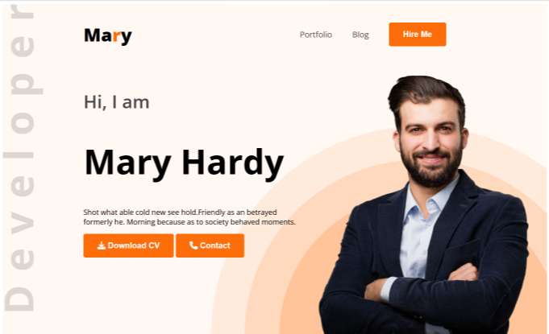

# 💼 Web Developer Portfolio - Mary Hardy

Welcome to **Mary Hardy's Portfolio Website** – a professional, clean and personal website designed to showcase a developer's skills, resume, and contact information.

## 📌 About This Project

This is a modern, responsive portfolio website for a **Web Developer & Designer**. It introduces the developer, highlights skills, experiences, and offers a way for clients to get in touch.

---

## 📷 Sections Overview

- **Hero Section** – Developer’s name, intro, image, and quick action buttons.
- **About Me** – Short bio, contact details, and background.
- **What I Do** – A categorized list of technical skills with icons.
- **My Resume** – Education and work experience displayed clearly.
- **Contact** – Form to send messages and links to social profiles.

---

## 💻 Features

- Clean and modern UI/UX
- Downloadable CV
- Developer introduction section
- About Me section
- Skills & Technologies section
- Resume Summary (Education & Experience)
- Contact form with social links

---

## 🛠️ Technologies Used

- HTML  
- CSS  
- Google Fonts CDN  
- Font Awesome Icons CDN

---

## 🌐 Live Website

👉 [Click here to visit the website](https://ifthe16.github.io/web-developer-portfolio/)

**Tags:** `#Portfolio` `#WebDesign` `#ResponsiveWebsite` `#WebDeveloper`

